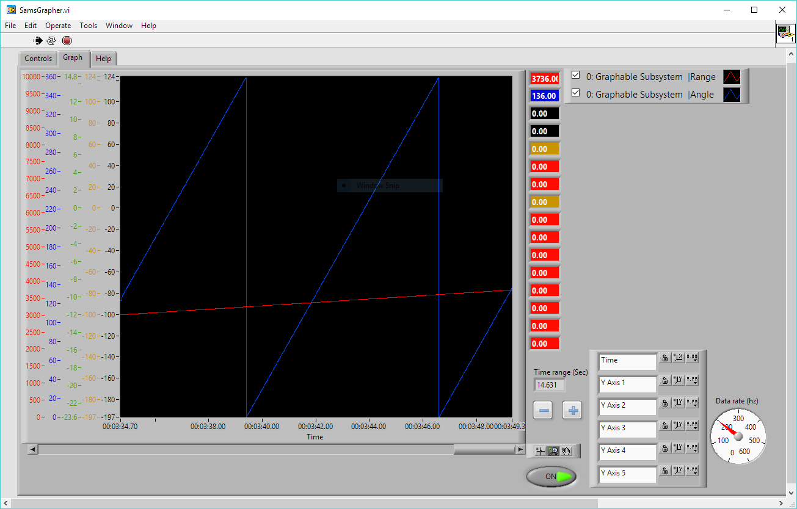

# Custom Item Example

This example application demonstrates how to use Third Coast Telemetry to instrument a mock robot subsystem called `GraphableSubsystem`.

Any class that implements the `org.strykeforce.thirdcoast.telemetry.item.Item` interface can be registered with the telemetry service for graphing. Method in the `Item` interface identify the subsystem and graphable measurements for the Grapher client.

The `org.strykeforce.thirdcoast.telemetry.grapher.Measure` enumeration that you use in the `Item` implementation has a large selection of measurement types that can be used to label appropriate measurements. For this example, we selected `Measure.ANGLE` and `Measure.RANGE`.

A driver station is not needed to run this example. When you build and deploy this to a roboRIO you should be able to connect to the disabled robot and display a graph:

